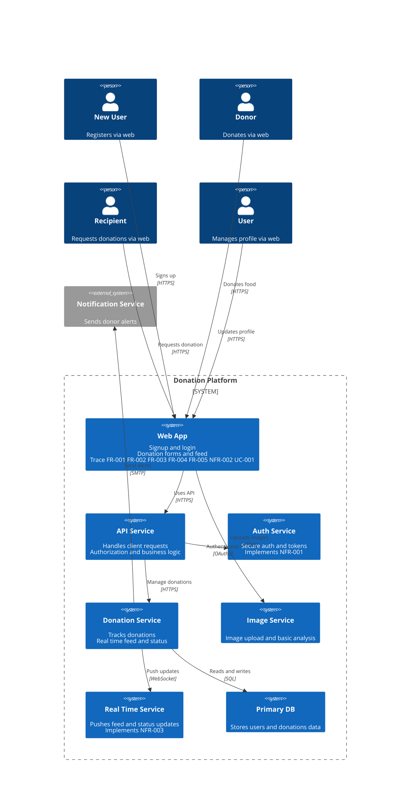

# System Context

**Type:** C4 Context
**Exported:** 2026-03-06T05:19:47.125Z
**Source:** PlanVersion

## Linked Requirements

- 1b2acded-0297-4eda-903e-9f0652e417d3
- ef85d342-3e93-48cc-8faa-b5e4690ace61
- 4cdfa39e-6913-4315-91a4-510b79967e49
- 1c32e5e0-6dd8-429d-b371-7c3324cc7ee2
- d531fa21-6fcd-440a-a8e2-2b3b319c764d
- 2c381a97-49e4-4a78-9721-d425977983c8
- 31dfc3a9-6960-4bfd-b8c3-d0248342d6f0
- 78b814a4-0ea6-4bf5-b2be-e7244af16c4b

## Diagram

